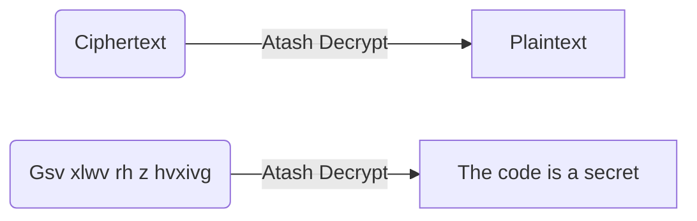

# Atbash Decryption Tool
My first Project in github 
I make this tool for Problem in MataCTF [Abashed Confessions](https://compete.metactf.com/289/problem?p=59)
A simple Python tool for decrypting messages encoded with the **Atbash cipher**.
The Atbash cipher is a classic substitution cipher where each letter is replaced with its reverse counterpart in the alphabet.

For example:
- A ↔ Z
- B ↔ Y
- C ↔ X
- ...
- M ↔ N

---

## Features

- Decrypt any Atbash-encoded message
- Handles both **uppercase** and **lowercase** letters
- Keeps numbers and special characters unchanged

---

## How It Works

This tool uses the Atbash cipher logic to reverse letters in the alphabet.

Example:

